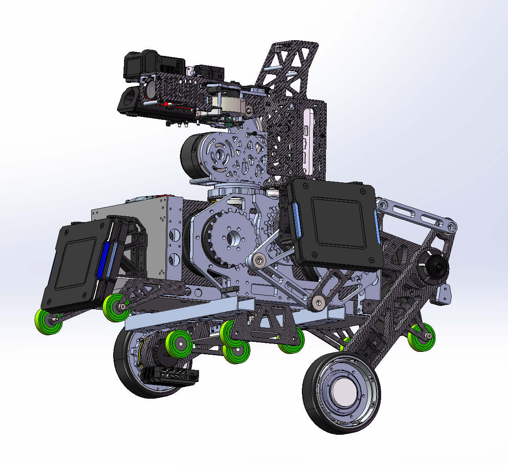
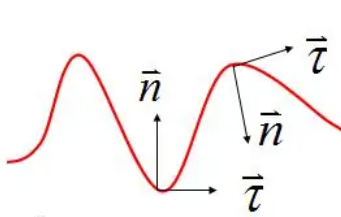
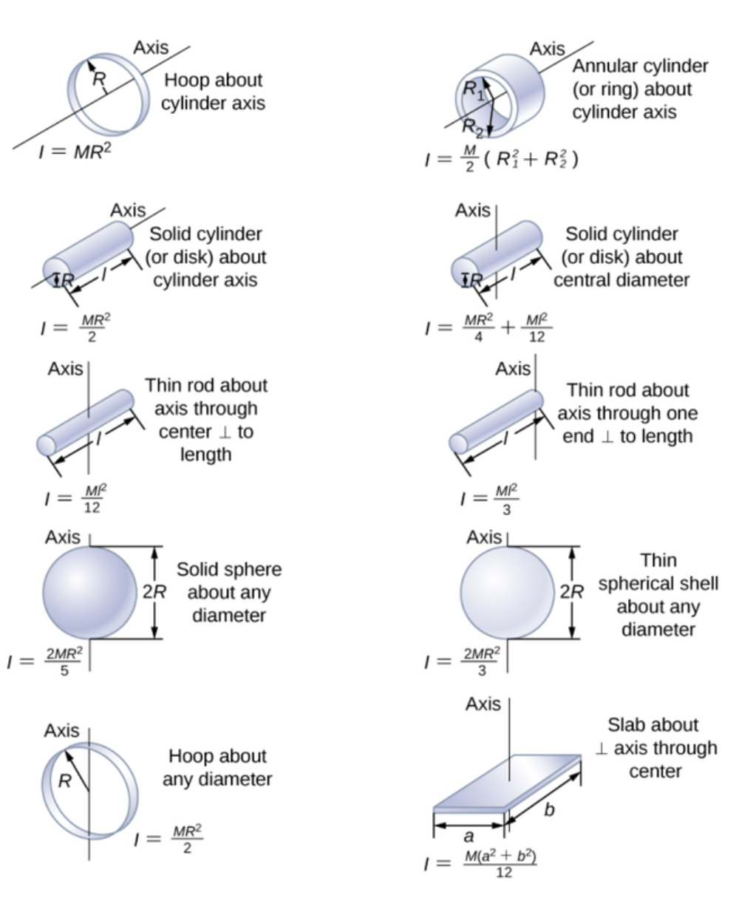
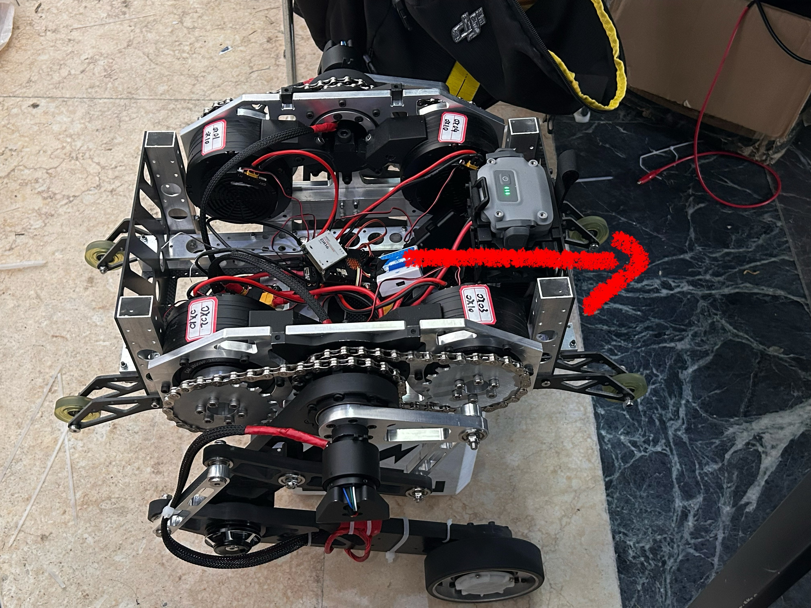
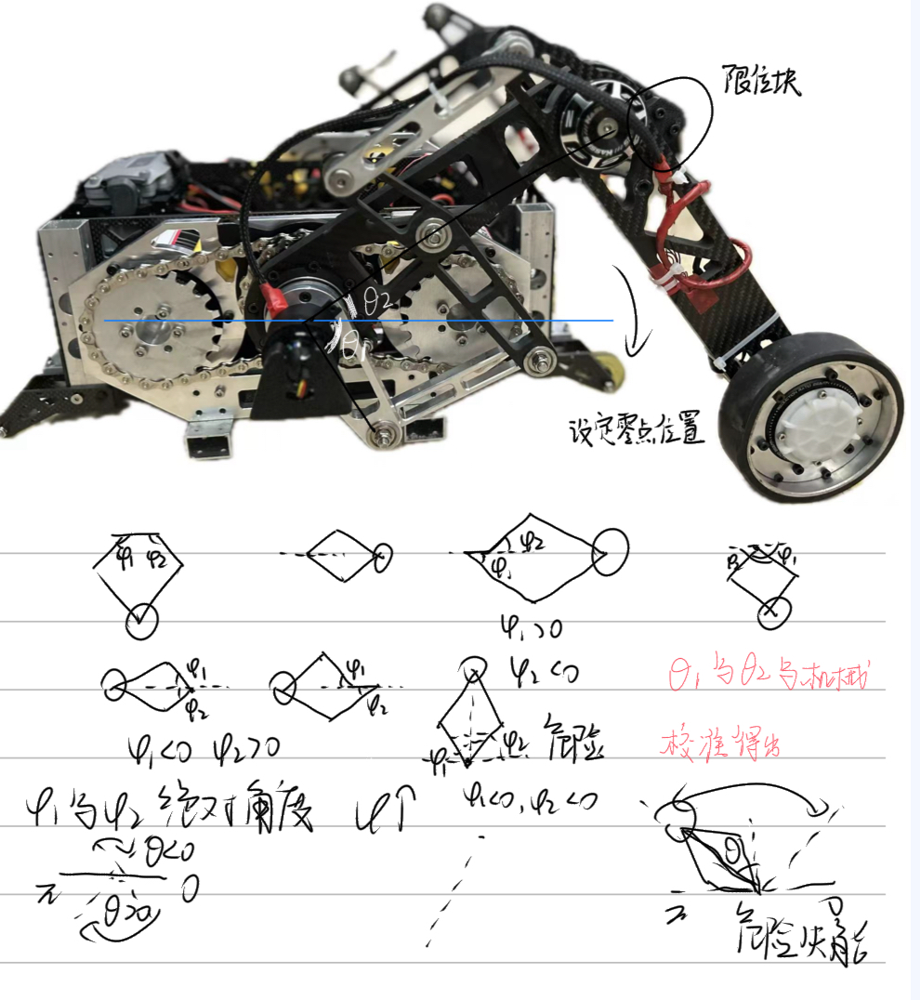
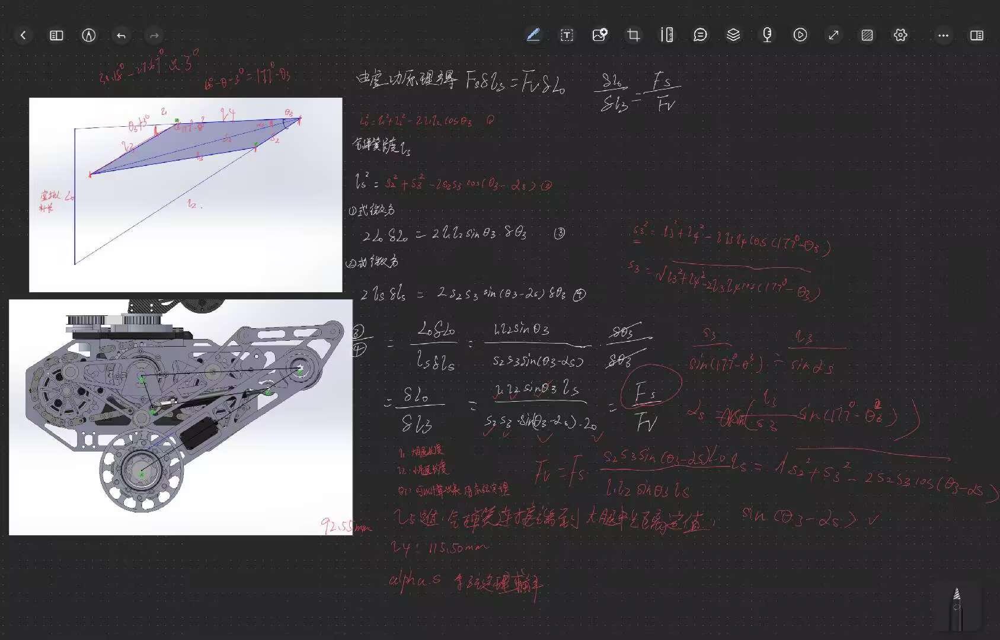
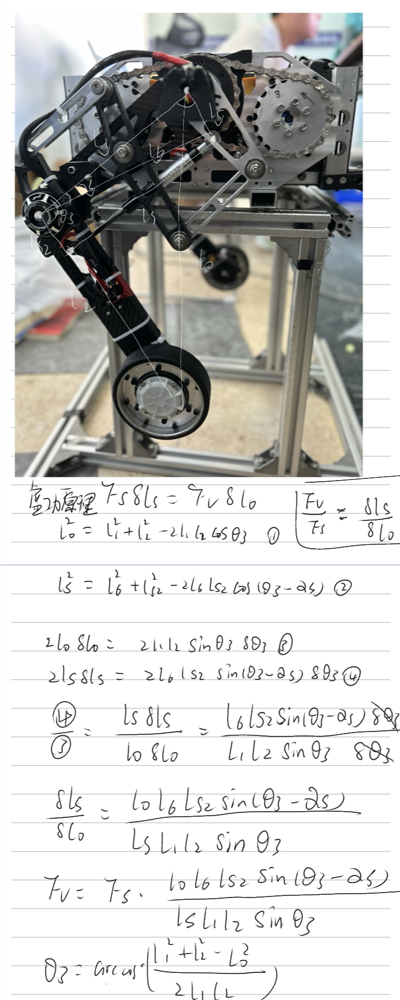
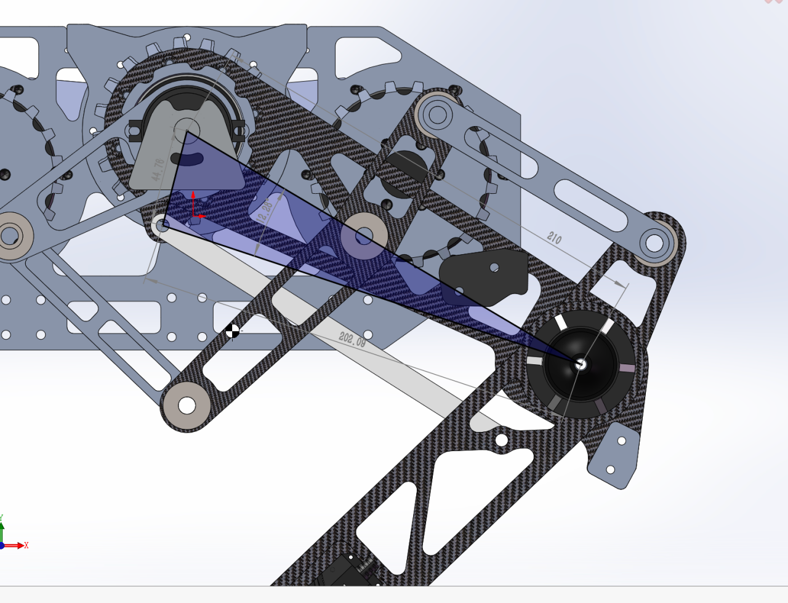
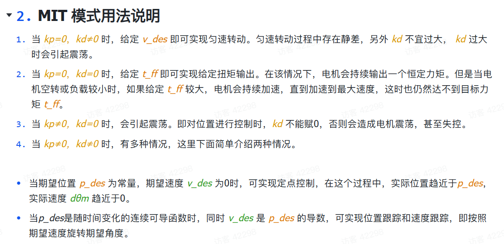

## 串联腿步兵的日常调试过程中的问题汇总[HNU_Shark]  
##  -- made by SuperChen    

### 底盘所使用的电机
[关节电机]DM_J8009P_2EC (具体的资料在Motor文件夹中)

[轮毂电机]DJI_3508_P19

### 串腿步兵参数[仅底盘云台未装]
>变量命名完全根据上交的开源  
  
串腿仅底盘基本结构(没装气簧):  
1.驱动轮半径 = 0.058(m)  
2.两个驱动轮间距/2 = 0.214(m)
3.机体质心到腿部关节中心距离 = 0.05423(m)  
4.驱动轮的质量 = 0.577(kg)  
5.腿部质量 = 0.804(kg)  
6.机体质量 = 6.120(kg)  
7.驱动轮转动惯量 = 970.514*10^(-6) (kg*m^2)  [按实心包胶轮算的]
8.机体转动惯量(自然坐标系法向) = 0.088434  (kg*m^2)  
9.机器人z轴转动惯量 = 0.07564(kg*m^2)

串腿没有云台时的参数:  

串腿安装云台时的参数: 

### 串腿步兵参数[云台安装] 
TODO
### 需要的基础知识  
我们串联腿采用上海交通大学云汉蛟龙2023年平步开源lqr建模WBR+哈工程vmc,参数很多但是可以把两条腿一起考虑进来,希望这次尝试可行吧  
交对于各个参量方向规定非常详细  
其中的自然坐标系只需关注切向(沿物体瞬时运动方向（轨迹切线方向)和法向(垂直于切向，指向轨迹曲率中心（凹侧）)  
  

[WBR控制](./上交平步开源/上海交通大学RoboMaster2023平衡步兵控制系统开源/WBR_control.html)  //文件夹中打开可跳转网页  

[WBR系统建模分析](./上交平步开源/上海交通大学RoboMaster2023平衡步兵控制系统开源/WBR_modeling.html)
  
[WBR腿部五连杆机构分析](./上交平步开源/上海交通大学RoboMaster2023平衡步兵控制系统开源/WBR_leg.html)  

可能你阅读以下内容感觉看不懂,可以先去B站看DR_can的关于现代控制理论;Lqr;kalman filter部分.以及控制之美的两册  
[这里有你所需要的全部理论知识->Dr_can](https://space.bilibili.com/230105574?spm_id_from=333.337.0.0)

[有关腿部VMC部分的分析腿长L0,从F和Tp反解T1,T2.王洪玺(2)](https://zhuanlan.zhihu.com/p/613007726)  

[打滑检测部分,王洪玺(3)](https://zhuanlan.zhihu.com/p/689921165)   

[山海机甲比较好的开源,提供了转向时将平步看成板凳进行LQR将算出的最优输入,  
delta_T以相反的符号加在左右lk电机最终的控制命令扭矩.  
同时有个思路可以尝试,使用LQR对yaw和pitch轴电机进行建模进而使用扭矩T进行控制](./Document/软件设计plus_山海机甲.pdf)%可以去文档里找,这里跳转只显示二进制文件  

[电科中山柳幸之开源中提及的使用相关算法进行matlab或python的计算,  
来确定Q和R的具体取值范围后续可以尝试,  
使用Knn算法进行离地检测后续我也打算试试](https://bbs.robomaster.com/article/22843?source=0)

[仿真部分:  
关于K的仿真,采用港大开源,做了符合我们代码的修改;  
](./Simulation/HerKules_VOCAL_SJ_LQR_v4_with_data.m)  
[仿真部分:  
关于转向部分的LQR建模求K,我们只保留了计算部分,仿真部分,感觉没什么必要  
使用时仅运行get_K即可,get_k_length只是被调用的函数;  
对于云台的pitch和yaw进行建模求K,山海机甲的思路;  
](./Simulation/bandeng.m)

### 调试中的问题
#### 2025.11.02  
* 目前dm8009p电机的驱动控制代码准备迁移中科大麻神的开源,这也是我第一次接触底层电机驱动  
* [麻神关于damiao电机的控制总结](https://www.bilibili.com/video/BV1B5p1e6Ew9/?spm_id_from=333.337.search-card.all.click)
* [达妙电机资料](https://gitee.com/kit-miao)
* [达妙电机上手流程](https://gl1po2nscb.feishu.cn/wiki/Se1Dw464piCcERktZuOco7IPnTb)

#### 2025.11.07 
* 
#ifdef __cplusplus  
    
extern "C" {
  
cpp代码
#endif  

#ifdef __cplusplus
  
}
#endif  
* 这种写法,通过gcc与g++同时分区域编译
* 这只是可以同时兼容c和cpp的一种写法,不推荐,我们的主体代码全是c,可以参考cpp代码思路但是最好不要移植cpp

#### 2025.11.19
* 警告不要在全是c的代码里塞cpp的东西,编译就算不报错了,但实际烧录之后测试任然会存在问题,中科大的开源只能参考思路,不要试图用他们的cpp代码,主要是编译器没法同时兼容  
* 现在框架任然使用并腿那一套,今天测试wbr腿部角度q的解算感觉没什么问题,修改了ht的驱动代码,改成dm的,收数据那一块不能直接用data[0]作为发送的ID,damiao是data[0]包含了ID和ERR,需要&oxof才行
* 目前的计划是单板全车控制,can1:4*8009+2*4310;can2:4*3508+2006+达妙imu模块+超电,比较极限了,接收nuc控制的usb过滑环到底盘
* [串腿wbr腿部解算参考,把交龙的开源讲的很细,很建议看看](https://www.bilibili.com/video/BV16Z421M7F3/?spm_id_from=333.1387.favlist.content.click)

### 2025.11.28
* 目前来说damiaoMC-02完成了代码迁移,用的是老工程的freertos配置,各线程运行正常,串口目前用不到,还没测,打算提前把gimbal,shoot,和cmd的线程按照老步兵的写一版,提前写好键盘和图片链路两版方案,虽然串腿目前的滑环无法支持把图传的串口线接到底盘
* 控制板会放在底盘
* M3508改减速箱之后电流扭矩系数还没有算,如果误差大的话得自己去测,电流和扭矩近似看成线性关系
* 点击控制指令使用正弦函数貌似会比线性指令运行更加丝滑后续试试
### 2025.11.28
* 3508电流扭矩系数计算,由官网3508资料中一拖四模式,使用电流电流控制,
* 16384对应20A最大电流,查手册3508最大电流10A,即对应的输入最大值为8192,xroll改减速箱后,堵转扭矩为3.69N.M,计算扭矩和电流之间的系数,8192/3.69=2220
* xroll减速箱的减速比是268/17

### 2025.12.24

* 后续腿部解算以此方向为基准
* 目前代码的uart_dma部分是照搬了辽科的王草凡的开源

* | 1 ----- 4 | 正方向  

* | 2 ----- 3 | ----->
### 2025.12.26
* 目前的关于uart_dma,can,referee_system的代码是参考 [辽科王草凡佬的](https://zhuanlan.zhihu.com/p/720966722)
* 代码在cubemx重新生成后main.c的void HAL_TIM_PeriodElapsedCallback(TIM_HandleTypeDef *htim)函数会报错删去即可,和motor_task里的重复定义了
### 2025.12.28
* 之前一直存在一个bug,电机有时候会在使能之后疯狂抽分,后面测试发现问题在DM_Motror.c中的static void dm_motor_control(void const *parameter)函数
其中的发送报文使用uint8_t data_buf[8]存储,动态分配内存并且没有初值会导致每次使用时其动态地址处的随机值被当做电机的控制数据发出导致抽疯[推测],非常危险
目前改成了static uint8_t data_buf[8] = {0};静态内存并且有初值
* 可以通过开发板灯是否闪烁判断程序是否卡死
### 2025.12.31
* dm8009电机目前使用的是angle_abs角度,这是绝对角度,不论转多少圈对应方向的角度不会改变,在
计算phi1和phi2时,因为中间处的齿轮与两侧对应关节电机通过链条连接,可以看成二者角度线性相关,理论上我们在设定好零点之后,再找到杆水平时对应的关节电机角度二者作差就可以得出phi1或是phi2
  
* 今年累了,不想调了,明年再说吧! 乾杯!!! 
### 2026.01.06
* 下午调试的时候,车冒烟了,经过排查时右侧轮子的3508供电三相线由于固定方式的问题,被外侧螺丝磨破皮了打在碳板上导致短路了,拷打机械固定方式必须要改 
### 2026.01.07
* 3508改减速箱,但是电调输出的角度为3508自己的角度,不是输出端的角度这需要转换,根据实际的减速比计算出输出端的角度;
* 目前收得到3508反馈的数据但是发送电流值电机不转,应该是底层发送函数的问题
* #define M3508_READUCTION_RATIO_R   14.08        //15.77/1.12 = 14.08  
  #define M3508_READUCTION_RATIO_L   12.543       //26.34/2.1 = 12.543 
* 1.12rad/s和2.1rad/s,这两个参数是在恒定3508输入值,两边一样,实测通过视频方式观察计算轮子的实际转速得出的,比较粗糙,后续看能不能用,因为c60只反馈转子的角度,改过减速箱了这部分数据修正
### 2026.01.08
* 目前的问题是LQROutBuf[0]和LQROutBuf[1]两个U矩阵参数,是T_lw_l和T_lw_r,这两个参数会一直跳变突变成一个很大的值,但是去查x的obs和ref没有突变的参数,k对应的k[0][0]-k[0][9],k[1][0]-k[1][9]也没有跳变,这就很奇怪了
* - 这是由于我限制了最大轮子的扭矩为3.69nm,但是算出来值会有时候远大于这个值
* 这是matlab里lqr计算关于A的权重里转向的权重太大了加上我把imu的加热关了,零漂太严重了导致,题外话imu加热最好在debug的时候关了,可以把加热的pid全给0,在rm_config.h注释掉BSP_USING_IMU_HEAT就行 
### 2026.01.10
* 依旧磕头(推测是thetab权重太大了),起不来,速度方向不太对啊,取运动方向为正,会导致轮子疯转收敛不了,取反向为正又可以收敛了,很奇怪
* 起立时可以像以前一样先收轮子,起来之后瞬间打开腿吗?后续试试看
### 2026.01.13
* 机体在站起来之后,轮子会一直往运动反方向加速,并且加速时两边的轮子速度不同,连杆也没有怎么纠正,连杆的姿态应该主要取决于轮子,感觉依旧是轮子的问题
### 2026.01.24
* 目前可以正常运动,但是由于腿部theta的影响加入补偿后任然会向前或者向后倾,无法稳定站立,同时无法做到不干预的情况下起立,目前想到的办法是通过板凳模型完成起立之后再进行lqr控制
### 2026.01.25
* 对于气弹簧的分析采用虚功原理(开源来源于串腿群群友)
* 对于氮气弹簧的分析如下图,得到了气弹簧FS与对应到竖直支持力的Fv的关系,腿部支持力计算时减去Fv,可以忽略掉气弹簧的影响
  
  
  
### 2026.01.31
* 现在为了使腿部可以匀速转动,尝试过lqr将pitch置0,只保持theta控制腿部转动,发现力控无法很好腿匀速转动,因为mit模式在t置零后相当于位置模式或是位置速度模式,可以尝试vmc逆解算出phi1和phi4再映射会输出轴角度控制电机旋转,达到腿部匀速转动的效果
* 
* 这是一个bug,dm的motor层DM_KP_MAX 10.0 DM_KP_MIN 0;DM_KD_MAX 5.0 DM_KD_MIN 0
* 电机mit模式下在腿部正常运动时使用mit的T控制p和v置零,腿部倒地自起摆动时使用位置速度控制,将t项置零
* 实测方案可行,可以通过mit中t项置零,使用p_des和V_des实现腿部近似匀速的转动,但要注意Kp要很小,V_des=0,Kd大一点但要在5以下(要维持匀速)
* 现在的主要问题怎么把逆解之后的角度映射回电机的原始角度实现位置控制
### 2026.02.01
* 要控制腿部转到目标位置,需要求vmc的逆解,[vmc逆解推导](https://zhuanlan.zhihu.com/p/1949868086950854786),这个推法可行,不过我们的对于phi1和phi4的定义和他是反的,实测发现两个解中只能采用一个,这是实测出来的,我也不知道两个解里要哪个,那就测一下
### 2023.02.03
* 目前要解决的问题是怎么让腿按照规定方向顺时针或是逆时针转动,而不是指定位置后一会沿优弧一会沿劣弧运动,倒地自起感觉只要清楚机体倒向那一侧腿往那侧摆动,在这之前需要将推摆到在同一侧,然后开始同时摆动,直到机体近似水平于地面且腿回到规定位置才开始起立