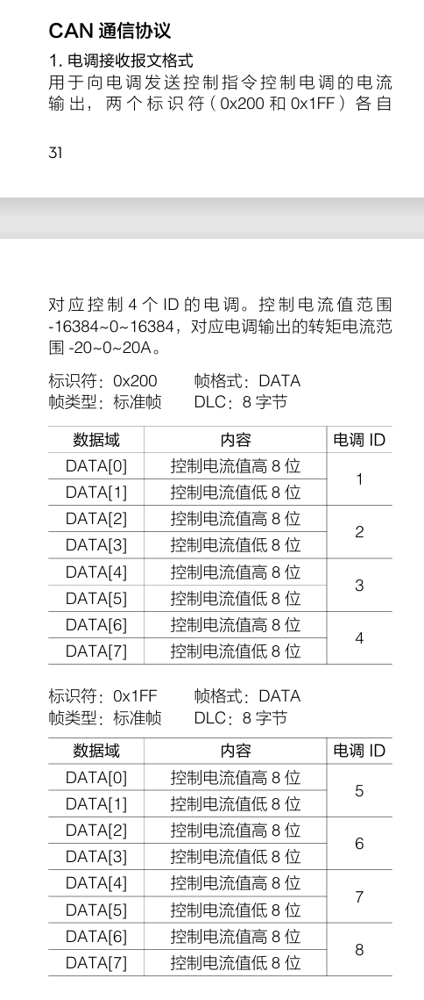
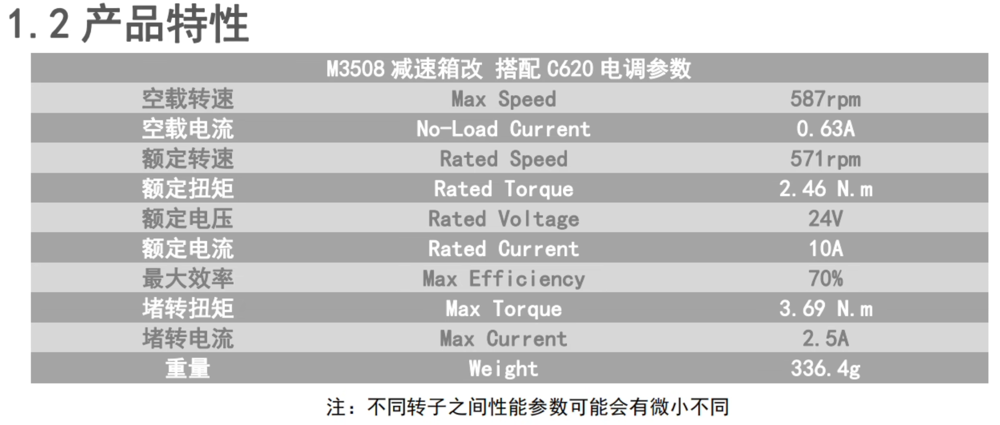

## 串联腿步兵的日常调试过程中的问题汇总[HNU_Shark]  
##  -- made by SuperChen    

### 底盘所使用的电机
[关节电机]DM_J8009P_2EC (具体的资料在Motor文件夹中)

[轮毂电机]DJI_3508_P19

### 串腿步兵参数[仅底盘云台未装]
>变量命名完全根据上交的开源  

串腿没有云台时的参数:  

串腿安装云台时的参数: 

### 串腿步兵参数[云台安装] 
TODO
### 需要的基础知识  
我们串联腿采用上海交通大学云汉蛟龙2023年平步开源lqr建模WBR+哈工程vmc,参数很多但是可以把两条腿一起考虑进来,希望这次尝试可行吧  
  
[WBR控制](./上交平步开源/上海交通大学RoboMaster2023平衡步兵控制系统开源/WBR_control.html)  //文件夹中打开可跳转网页  

[WBR系统建模分析](./上交平步开源/上海交通大学RoboMaster2023平衡步兵控制系统开源/WBR_modeling.html)
  
[WBR腿部五连杆机构分析](./上交平步开源/上海交通大学RoboMaster2023平衡步兵控制系统开源/WBR_leg.html)  

可能你阅读以下内容感觉看不懂,可以先去B站看DR_can的关于现代控制理论;Lqr;kalman filter部分.以及控制之美的两册  
[这里有你所需要的全部理论知识->Dr_can](https://space.bilibili.com/230105574?spm_id_from=333.337.0.0)

[有关腿部VMC部分的分析腿长L0,从F和Tp反解T1,T2.王洪玺(2)](https://zhuanlan.zhihu.com/p/613007726)  

[打滑检测部分,王洪玺(3)](https://zhuanlan.zhihu.com/p/689921165)   

[山海机甲比较好的开源,提供了转向时将平步看成板凳进行LQR将算出的最优输入,  
delta_T以相反的符号加在左右lk电机最终的控制命令扭矩.  
同时有个思路可以尝试,使用LQR对yaw和pitch轴电机进行建模进而使用扭矩T进行控制](./Document/软件设计plus_山海机甲.pdf)%可以去文档里找,这里跳转只显示二进制文件  

[电科中山柳幸之开源中提及的使用相关算法进行matlab或python的计算,  
来确定Q和R的具体取值范围后续可以尝试,  
使用Knn算法进行离地检测后续我也打算试试](https://bbs.robomaster.com/article/22843?source=0)

[仿真部分:  
关于K的仿真,采用港大开源,做了符合我们代码的修改;  
](./Simulation/HerKules_VOCAL_SJ_LQR_v4_with_data.m)  
[仿真部分:  
关于转向部分的LQR建模求K,我们只保留了计算部分,仿真部分,感觉没什么必要  
使用时仅运行get_K即可,get_k_length只是被调用的函数;  
对于云台的pitch和yaw进行建模求K,山海机甲的思路;  
](./Simulation/bandeng.m)

### 调试中的问题
#### 2025.11.02  
* 目前dm8009p电机的驱动控制代码准备迁移中科大麻神的开源,这也是我第一次接触底层电机驱动  
* [麻神关于damiao电机的控制总结](https://www.bilibili.com/video/BV1B5p1e6Ew9/?spm_id_from=333.337.search-card.all.click)
* [达妙电机资料](https://gitee.com/kit-miao)
* [达妙电机上手流程](https://gl1po2nscb.feishu.cn/wiki/Se1Dw464piCcERktZuOco7IPnTb)

#### 2025.11.07
* 整理一下代码,目前modules/can和modules/motor/dm_motor采用中科大麻神开源
* 由于dvc_motor_dm.cpp是cpp文件,我们主体是c文件,二者无法很好的兼容,所以我把chassis_task需要的底层用cpp写的dm8009p驱动,再往上封装一层留给c文件的接口  
* 
#ifdef __cplusplus  
    
extern "C" {
    
#endif  

#ifdef __cplusplus
  
}
#endif  
* 目前通过这种写法,通过gcc与g++同时分区域编译
* 至于说电机数据我在chassis线程怎么读到,以及我怎么把电机的控制参数传输到底层cpp
* 我参考了牢大的双向数据流写法(通过地址实现)
- 控制参数流： Dm_Motor[x]->dm8009P_set → dm8009p_obj_t[i]->dm8009P_set → 通过 Dm8009_Set_Control() 函数设置给电机
- 反馈数据流向：电机反馈 → dm8009p_obj_t[i]->dm8009_read → Dm_Motor[x]->dm8009_read → 供chassis_task使用  
* 大概这么个思路
* 关于dm8009的can数据发送是在task/motor_task.c中的定时中断回调中进行的,而dm8009的can数据接收是在modules/can/drv_can.c中的CAN1_Motor_Call_Back()函数进行的,而为什么can1收到数据的回调函数是这个
因为main.c中的CAN_Init(&hcan1,CAN1_Motor_Call_Back)进行与can1的绑定,在drc_can.c中HAL_CAN_RxFifo0MsgPendingCallback中存在CAN1_Motor_Call_Back实现回调
#### 2025.11.19
* 警告不要在全是c的代码里塞cpp的东西,编译就算不报错了,但实际烧录之后测试任然会存在问题,中科大的开源只能参考思路,不要试图用他们的cpp代码,主要是编译器没法同时兼容  
* 现在框架任然使用并腿那一套,今天测试wbr腿部角度q的解算感觉没什么问题,修改了ht的驱动代码,改成dm的,收数据那一块不能直接用data[0]作为发送的ID,damiao是data[0]包含了ID和ERR,需要&oxof才行
* 目前的计划是单板全车控制,can1:4*8009+2*4310;can2:4*3508+2006+达妙imu模块+超电,比较极限了,接收nuc控制的usb过滑环到底盘
* [串腿wbr腿部解算参考,把交龙的开源讲的很细,很建议看看](https://www.bilibili.com/video/BV16Z421M7F3/?spm_id_from=333.1387.favlist.content.click)

### 2025.11.28
* 目前来说damiaoMC-02完成了代码迁移,用的是老工程的freertos配置,各线程运行正常,串口目前用不到,还没测,打算提前把gimbal,shoot,和cmd的线程按照老步兵的写一版,提前写好键盘和图片链路两版方案,虽然串腿目前的滑环无法支持把图传的串口线接到底盘
* 控制板会放在底盘
* M3508改减速箱之后电流扭矩系数还没有算,如果误差大的话得自己去测,电流和扭矩近似看成线性关系
* 点击控制指令使用正弦函数貌似会比线性指令运行更加丝滑后续试试
### 2025.11.28
* 3508电流扭矩系数计算,由官网3508资料中一拖四模式,使用电流电流控制,
* 16384对应20A最大电流,查手册3508最大电流10A,即对应的输入最大值为8192,xroll改减速箱后,堵转扭矩为3.69N.M,计算扭矩和电流之间的系数,8192/3.69=2220
